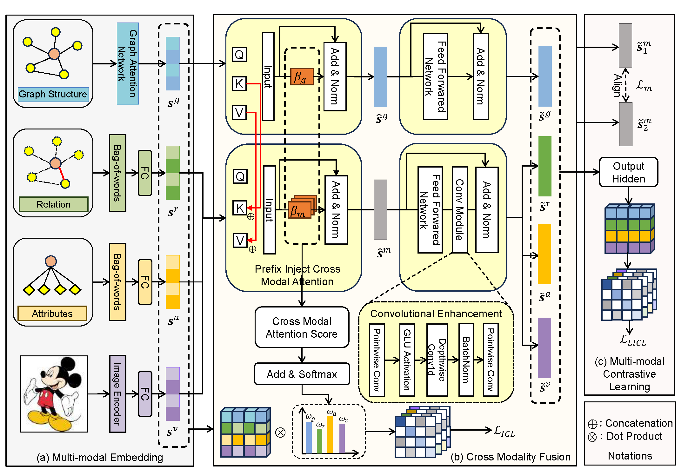

# GSIEA
Graph Structure Prefix Injection Transformer for Multi-modal Entity Alignment

## Overview

<p align="center">
   
</p>
The overall framework of GSIEA.

## Dependencies
```bash
pip install -r requirement.txt
```
#### Details
- Python (>= 3.7)
- [PyTorch](http://pytorch.org/) (>= 1.6.0)
- numpy (>= 1.19.2)
- easydict (>= 1.10)
- unidecode (>= 1.3.6)
- tensorboard (>= 2.11.0)

## Train
- **Quick start**: Using  script file (`run.sh`)
```bash
>> cd GSIEA
>> bash run.sh
```
## Dataset
Dataset download from [GoogleDrive](https://drive.google.com/file/d/1qweGZPvsqVOJf9ORs0kc8Eo2rCY7g3mM/view?usp=drive_link)
```
ROOT
├── data
│   └── mmkg
└── code
    └── GSIEA
```
## Citation
```
@article{GSIEA,
   author = {Zhang, Yan and Luo, Xiangyu and Hu, Jing and Zhang, Miao and Xiao, Kui and Li, Zhifei},
   title = {Graph structure prefix injection transformer for multi-modal entity alignment},
   journal = {Information Processing & Management},
   volume = {62},
   number = {3},
   pages = {104048},
   year = {2025}
}
```
